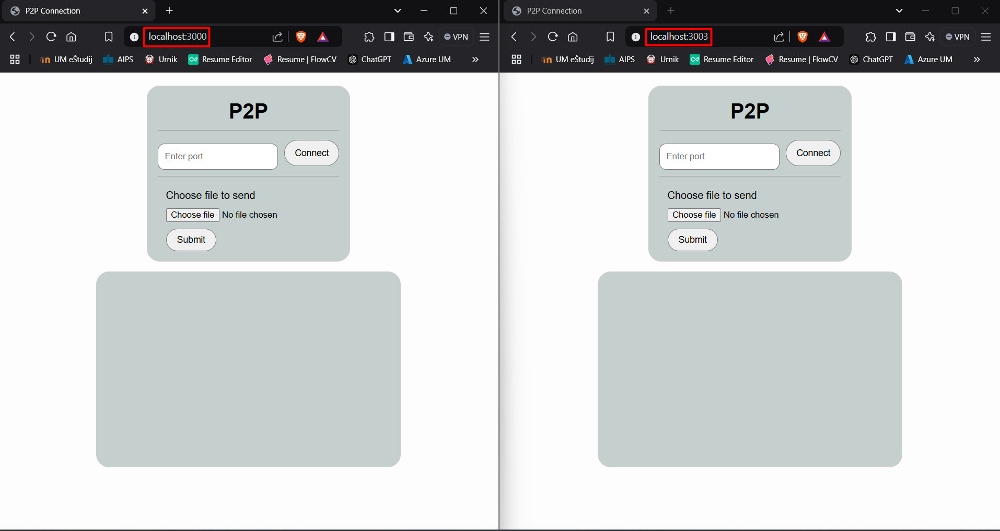
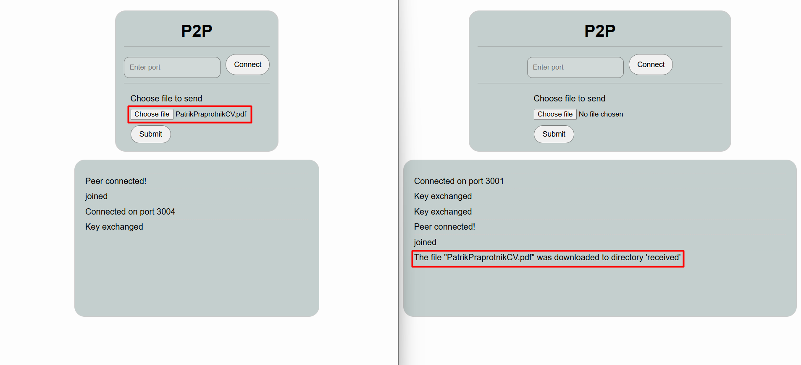

# P2P Connection Web Application

This repository contains a web application that demonstrates peer-to-peer (P2P) connections using WebSockets and encryption techniques. It enables users to establish direct connections, exchange encrypted messages, and securely transfer files between peers. This README provides an overview of the application, setup instructions, and theoretical concepts to help you get started.

## Features

- **P2P Connection**: Establish a direct connection with peers over a specified port.
- **File Transfer**: Securely upload and send files to connected peers.
- **End-to-End Encryption**: Uses AES and Diffie-Hellman algorithms to ensure secure data transfer.

---

## How It Works

This application employs the following technologies and concepts:

### Peer-to-Peer Communication
P2P communication allows devices to connect directly without relying on a central server for data exchange. This application uses the `socket.io-p2p` library to establish and manage these connections.

### Encryption
- **Diffie-Hellman Key Exchange**: Used to securely exchange encryption keys between peers.
- **AES Encryption**: Ensures secure file transmission by encrypting files before transfer.
- **Triple DES**: Provides additional encryption for messages sent via WebSocket.

### File Upload and Transfer
Files are handled using the `socket.io-file` library, allowing users to upload files, which are then encrypted, transferred, and decrypted at the destination.

---

## Prerequisites

Ensure you have the following installed on your system:

- Node.js (v14 or later)
- npm (Node Package Manager)

---

## Installation

1. Clone this repository:
   ```bash
   git clone <repository-url>
   ```

2. Navigate to the project directory:
   ```bash
   cd P2P-File-Transfer
   ```

3. Install dependencies:
   ```bash
   npm install
   ```

4. Run the application (2 terminals for 2 applications/peers):
   ```bash
   node server.js <appPort1> <p2pPort1>
   node server.js <appPort2> <p2pPort2>
   ```
   Replace `<appPort>` and `<p2pPort>` with your desired ports for the application and P2P connections, respectively.

---

## Usage

1. Open the application in your browser:
   ```
   http://localhost:<appPort>
   ```

2. Enter the port to establish a P2P connection and click **Connect**.

3. To send a file:
   - Select a file using the file input.
   - Click **Submit** to upload and transfer the file to the peer.

4. Messages and logs will appear in the message container.

---

## Screenshots

### Main Interface


### File Transfer


---

## File Structure

```
├── index.html          # Frontend of the application
├── script.js           # Client-side logic
├── server.js           # Backend logic for P2P connections
├── package.json        # Dependencies and scripts
└── README.md           # Documentation
```

---

## Technical Notes

- **Encryption**:
  - Files are encrypted using AES before transfer and decrypted upon receipt.
  - Triple DES encrypts messages for secure communication.

- **Folder Structure**:
  - Uploaded files are stored first in `download/` directory, then temporarily in the `data/` directory.
  - Encrypted files are saved in the `encrypted/` directory.
  - Decrypted files are saved in the `received/` directory.

- **Key Exchange**:
  - Diffie-Hellman keys are generated for each session to maintain unique encryption keys.

---

## Dependencies

- [socket.io](https://socket.io/)
- [socket.io-p2p](https://github.com/socketio/socket.io-p2p)
- [socket.io-file](https://github.com/rico345100/socket.io-file)
- [crypto-js](https://github.com/brix/crypto-js)
- [express](https://expressjs.com/)
